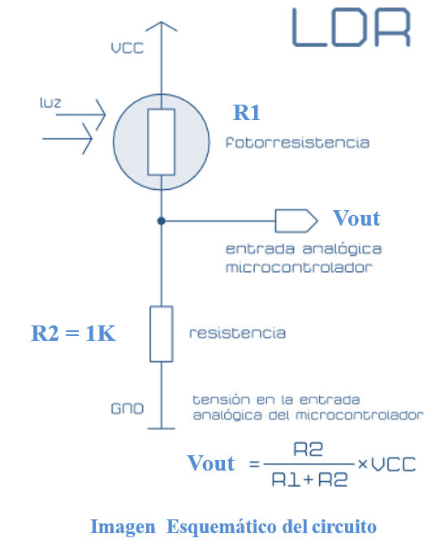

# Introducción

## :trophy: A.1.2 Actividad de aprendizaje

## Objetivo

Realizar un sensor medidor de luz (lux) a través de un circuito electrónico, utilizando un simulador, y  un **LDR (Light dependent Resistor)**.

### :blue_book: Instrucciones

- Se sugiere para el desarrollado de la presenta actividad, utilice uno de los siguientes simuladores: [Autodesk Tinkercad](https://www.tinkercad.com/), [Virtual BreadBoard](http://www.virtualbreadboard.com/), [Easy EDA](https://easyeda.com/) por lo cual habrá que familiarizarse antes, e incluso instalarse o registrarse dentro de la plataforma.
- Toda actividad o reto se deberá realizar, utilizando el estilo **MarkDown con extension .md** y el entorno de desarrollo VSCode, debiendo ser elaborado como un documento **single page**, es decir si el documento cuanta con imágenes, enlaces o cualquier documento externo debe ser accedido desde etiquetas y enlaces, y debe ser nombrado con la nomenclatura **A1.2_NombreApellido_Equipo.pdf.**
- Es requisito que el .MD contenga una etiqueta del enlace al repositorio de su documento en GITHUB, por ejemplo **Enlace a mi GitHub** y al concluir el reto se deberá subir a github.
- Desde el archivo **.md** exporte un archivo **.pdf** que deberá subirse a classroom dentro de su apartado correspondiente, sirviendo como evidencia de su entrega, ya que siendo la plataforma **oficial** aquí se recibirá la calificación de su actividad.
- Considerando que el archivo .PDF, el cual fue obtenido desde archivo .MD, ambos deben ser idénticos.
- Su repositorio ademas de que debe contar con un archivo **readme**.md dentro de su directorio raíz, con la información como datos del estudiante, equipo de trabajo, materia, carrera, datos del asesor, e incluso logotipo o imágenes, debe tener un apartado de contenidos o indice, los cuales realmente son ligas o **enlaces a sus documentos .md**, _evite utilizar texto_ para indicar enlaces internos o externo.
- Se propone una estructura tal como esta indicada abajo, sin embargo puede utilizarse cualquier otra que le apoye para organizar su repositorio.
  
```
- readme.md
  - blog
    - C0.1_x.md
    - C0.2_x.md
  - img
  - docs
    - A0.1_x.md
    - A0.2_x.md
    - A1.2_x.md
    - A1.3_x.md
```


### :pencil2: Desarrollo

1. Utilice el siguiente listado de materiales para la elaboración de la actividad y agregue en la columna Fuente de consulta su enlace _bibliográfico_.

    | Cantidad | Descripción                      | Fuente de consulta |
    | -------- | -------------------------------- | ------------------ |
    | 1        | Sensor Fotoresistencia LDR de 2M |   [Naylamp mechatronics,datasheet](https://pi.gate.ac.uk/pages/airpi-files/PD0001.pdf)                 |
    | 1        | Resistencia 1k                   | [Resistencia](https://www.zonamaker.com/electronica/intro-electronica/componentes/la-resistencia)                    |
    | 1        | Fuente de alimentación de 5v.    |   [Fuente de alimentacion](http://www.bolanosdj.com.ar/MOVIL/ARDUINO2/FuenteProtoboard.pdf)   |

2. Considerando que el elemento LDR es un sensor fotoresistivo es decir varia su resistencia en base a la cantidad de luz que incide sobre el, **Que observa en el grafico siguiente?**  
   Se puede observar que el valor de la resistencia es mayor cuando menos luz hay y menor resistencia cuando hay mayor iluminación
   
<p align="center">
    
</p>

1. Ensamble el circuito que se muestra utilizado el simulador que halla considerado, colocando la fotorresistencia en la posición LDR y resistencia de acuerdo con la imagen del esquemático:

    <p align="center"> 
        
    </p>
2. coloque la imagen finalmente obtenida del circuito ensamblado dentro de su simulador.
   
3. Mida la **resistencia** de la fotorresistencia con el ohmetro bajo las siguientes condiciones: ausencia de luz u oscuridad,  luz ambiente, luz intensiva y registre en la tabla correspondiente.
4. Calcule el **valor de voltaje Vout teórico** para cada una de las condiciones antes indicadas asi como el valor de voltaje Vout medido  y registre en la tabla correspondiente.
5. Calcule el **valor de exactitud** de voltaje entre lo teórico y lo medido para cada condición  y registre en la tabla correspondiente.

    | Condicion          |  Impedancia en fotoresistencia | Voltaje Vout teórico | Voltaje Vout medido | %  V.Medido/ V.Teórico |
    | --------------- | ----------------------------- | -------------------- | ------------------- | ---------------------- | 
    | Ausencia de luz |180 kohms| 0.02762 v|27.7 mV|1.003
    | Luz ambiental   |912 ohms| 2.615 v|  2.57v | 0.982
    | Luz intensa     |506 ohms| 3.320 v|  3.32v | 1

6. **Grafique** a través de los valores registrados en la tabla anterior de tal manera que se pueda observar el comportamiento de la curva del componente LDR e **inserte la grafica**.


7. Inserte imágenes de **evidencias** tales como son reuniones  de los integrantes del equipo realizadas para el desarrollo de la actividad


1.  Incluya las conclusiones individuales y resultados observados durante el desarrollo de la actividad.

Jorge Diaz    
- En esta practica se pudo observar el funcionamiento del LDR o la fotorresistencia ya que este componente hace variar su resistencia dependiendo de la intensidad de la luz, con la ayuda de los resultados de la practica podemos observar la dependencia entre el voltaje y la resistencia ya que con el LDR entre mas intensidad de luz se presente, menos resistencia tendra por lo tanto el voltaje de salida aumentara y entre menos intensidad se presente mayor sera la resistencia del mismo y el voltaje disminuira.

Julio Jimenez
- En conclusión, la practica nos mostraba la capacidad de distintos compentes, en este caso el sensor de fotorresistencia. No solo se puede obsevar su comportamiento en la grafica que se nos mostró, también al realizar los calculo y medir se puede ver que es inversamente proporcional la impedancia con la iluminasión, entre mayor iluminasión menor resistencia y viceversa. 

Alexis Gonzalez
- En esta practica pudimos observar el comportamiento del sensor de fotorresistencia. Como la intensidad luminica se ve afectada respecto al voltaje que se deja pasar por el fotorresistor. Y esto se puede observar en los calculos por que cuanto mayor resistencia tenemos menor es el voltaje y menor es la intensidad de la luz que se genera.

### :bomb: Rubrica

| Criterios     | Descripción                                                                                  | Puntaje |
| ------------- | -------------------------------------------------------------------------------------------- | ------- |
| Instrucciones | Se cumple con cada uno de los puntos indicados dentro del apartado Instrucciones?            | 10      |  | 5 |
| Desarrollo    | Se respondió a cada uno de los puntos solicitados dentro del desarrollo de la actividad?     | 60      |
| Demostración  | El alumno se presenta durante la explicación de la funcionalidad de la actividad?            | 20      |
| Conclusiones  | Se incluye una opinión personal de la actividad  por cada uno de los integrantes del equipo? | 10      |

:house: [Ir a mi GitHub](https://github.com/JJimenez2117/SistemasProg/blob/master/README.md)