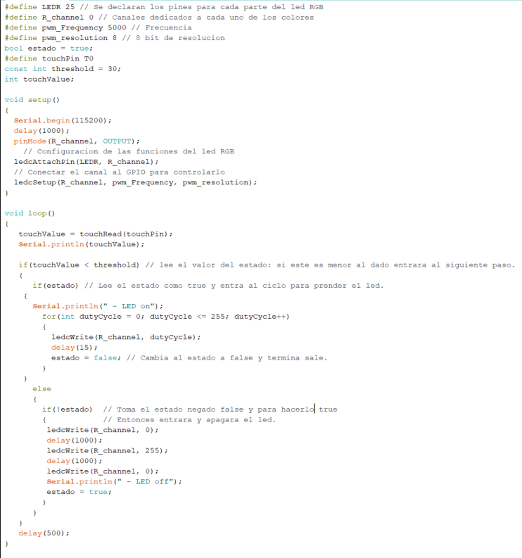

# :trophy: A.3.2 Actividad de aprendizaje

Circuito sensor de tacto a través de un NodeMCU ESP32
___

## Instrucciones

- Basado en la figura 1, ensamblar un sistema, capaz de responder al tacto, a través de un circuito electrónico, utilizando un NodeMCU **ESP32**, un  **Sensor de tacto capacitivo**.
- Toda actividad o reto se deberá realizar utilizando el estilo **MarkDown con extension .md** y el entorno de desarrollo VSCode, debiendo ser elaborado como un documento **single page**, es decir si el documento cuanta con imágenes, enlaces o cualquier documento externo debe ser accedido desde etiquetas y enlaces, y debe ser nombrado con la nomenclatura **A3.2_NombreApellido_Equipo.pdf.**
- Es requisito que el .md contenga una etiqueta del enlace al repositorio de su documento en GITHUB, por ejemplo **Enlace a mi GitHub** y al concluir el reto se deberá subir a github.
- Desde el archivo **.md** exporte un archivo **.pdf** que deberá subirse a classroom dentro de su apartado correspondiente, sirviendo como evidencia de su entrega, ya que siendo la plataforma **oficial** aquí se recibirá la calificación de su actividad.
- Considerando que el archivo .PDF, el cual fue obtenido desde archivo .MD, ambos deben ser idénticos.
- Su repositorio ademas de que debe contar con un archivo **readme**.md dentro de su directorio raíz, con la información como datos del estudiante, equipo de trabajo, materia, carrera, datos del asesor, e incluso logotipo o imágenes, debe tener un apartado de contenidos o indice, los cuales realmente son ligas o **enlaces a sus documentos .md**, _evite utilizar texto_ para indicar enlaces internos o externo.
- Se propone una estructura tal como esta indicada abajo, sin embargo puede utilizarse cualquier otra que le apoye para organizar su repositorio.
  
```
- readme.md
  - blog
    - C3.1_TituloActividad.md
    - C3.2_TituloActividad.md
    - C3.3_TituloActividad.md
    - C3.4_TituloActividad.md
    - C3.5_TituloActividad.md
    - C3.6_TituloActividad.md
    - C3.7_TituloActividad.md
    - C3.8_TituloActividad.md
  - img
  - docs
    - A3.1_TituloActividad.md
    - A3.2_TituloActividad.md
    - A3.3_TituloActividad.md
```
___

### Fuentes de apoyo para desarrollar la actividad

- [x] [Sensor de tacto capacitivo](https://randomnerdtutorials.com/esp32-touch-pins-arduino-ide/)
- [x] [Salida analogica PWM](https://randomnerdtutorials.com/esp32-pwm-arduino-ide/)

___

## Desarrollo

1.Utilice el siguiente listado de materiales para la elaboración de la actividad

| Cantidad | Descripción                                                                                                                                                                                                                |
| -------- | -------------------------------------------------------------------------------------------------------------------------------------------------------------------------------------------------------------------------- |
| 1        | [Diodo led Rojo](https://www.steren.com.mx/led-ultrabrillante-de-5-mm-color-rojo.html)                                                                                                                                                                                                             |
| 1        | Resistencia 330 [ohms](https://www.steren.com.mx/resistencia-de-carbon-de-1-2-watt-al-5-de-tolerancia-de-330-ohms.html)                                                                                                                                                                                                       |
| 1        | Fuente de voltaje de [5V](https://www.finaltest.com.mx/product-p/art-6.htm)                                                                                                                                                                                                    |
| 1        | [NodeMCU ESP32](https://www.amazon.com.mx/ESP-32-ESP-32S-ESP-WROOM-32-ESP32-S-desarrollo/dp/B07TBFC75Z/ref=sr_1_2?__mk_es_MX=%C3%85M%C3%85%C5%BD%C3%95%C3%91&dchild=1&keywords=esp32&qid=1599003438&sr=8-2)                |
| 1        | [BreadBoard](https://www.amazon.com.mx/Deke-Home-Breadboard-distribuci%C3%B3n-electr%C3%B3nica/dp/B086C9HK7V/ref=sr_1_22?__mk_es_MX=%C3%85M%C3%85%C5%BD%C3%95%C3%91&dchild=1&keywords=breadboard&qid=1599003455&sr=8-22)   |
| 1        | [Jumpers M/M](https://www.amazon.com.mx/ELEGOO-Macho-Hembra-Macho-Macho-Hembra-Hembra-Protoboard/dp/B06ZXSQ5WG/ref=sr_1_1?__mk_es_MX=%C3%85M%C3%85%C5%BD%C3%95%C3%91&dchild=1&keywords=jumper+wires&qid=1599003519&sr=8-1) |
| 1        | Hoja de aluminio    

                                                                                                                                    
<p align="center"> 
    <strong>Figura 1 Circuito ESP32 IC L293 Motor DC</strong>
    
</p>

1. Una vez ensamblado el circuito anterior, realice un programa que permita al ensamble cumplir con las siguientes condiciones:
    - El sistema deberá ser capaz de encender y apagar **un led** al presionar el sensor de tacto.
    - El sistema deberá tener la característica que si el Led esta encendido, al tocar el sensor de tacto, este iniciara un secuencia de intermitencia de 3 segundos (es decir se apaga 1 segundo, se enciende un segundo y se apaga finalmente).
    - El sistema deberá contar con la característica que si el Led esta apagado, al tocar el sensor de tacto, este se encenderá poco a poco hasta llegar a su nivel máximo de iluminación.
2. Coloque aquí evidencias que considere importantes durante el desarrollo de la actividad.
[Video demostrativo](https://www.youtube.com/watch?v=2AJphsuvfCg&feature=youtu.be)




Alexis Gonzalez
Con esta práctica realizada se puso a prueba las dos prácticas anteriores, la C3.7 y la C3.8. Para mi fue una pequeña combinación de ambas y un valor extra que viene siendo el Booleano para poder complementar lo que faltaba para que el led se mantuviera encendido una vez tocado el sensor y se apagar hasta que se volviera a tocar. Esto es como las lámparas para escritorio o las que van a lado de la cama. Y esto da una idea de todo lo que podemos hacer con el microcontrolador ESP32 ya que integra muchas funciones con las que se pueden experimentar.

Jorge Diaz
Con la realización de esta práctica nos podemos dar cuenta cuenta de el funcionamiento que puede tener un esp32 y los GPIO que lo conforman siendo capaz de detectar cualquier cosa que tenga una carga eléctrica y en el caso de esta práctica se demuestra que incluso puede detectar con la piel humana usando los dedos, en el esp32 podemos usar cualquier pin como pin de entrada teniendo así un valor máximo después de hacer contacto con el pin y un valor mínimo sin hacer contacto siendo así un componente en el que se puedan realizar diferentes variaciones para prácticas interesantes. 

Julio Jimenez
En conclusión podemos decir que en esta práctica se puede observar una de las funciones principales del ESP32 y ver porqué es tan flexible su uso. En la práctica se utilizó el sensor para poder detectar el tacto y así accionar el resto del circuito. Aunque por otra parte la programación implementada fue esencial para el funcionamiento y aprendizaje de la práctica.

### :bomb: Rubrica

| Criterios     | Descripción                                                                                  | Puntaje |
| ------------- | -------------------------------------------------------------------------------------------- | ------- |
| Instrucciones | Se cumple con cada uno de los puntos indicados dentro del apartado Instrucciones?            | 10      |
| Desarrollo    | Se respondió a cada uno de los puntos solicitados dentro del desarrollo de la actividad?     | 60      |
| Demostración  | El alumno se presenta durante la explicación de la funcionalidad de la actividad?            | 20      |
| Conclusiones  | Se incluye una opinión personal de la actividad  por cada uno de los integrantes del equipo? | 10      |

:house: [Ir a GitHub de Julio Jimenez](https://github.com/JJimenez2117/SistemasProg)

:house: [Ir a GitHub de Jorge Diaz](https://github.com/JDavidDiaz/Sistemas-Programables)

:house: [Ir a GitHub de Alexis Gonzalez](https://github.com/GlzAlexis/Sistemas_Programables)

