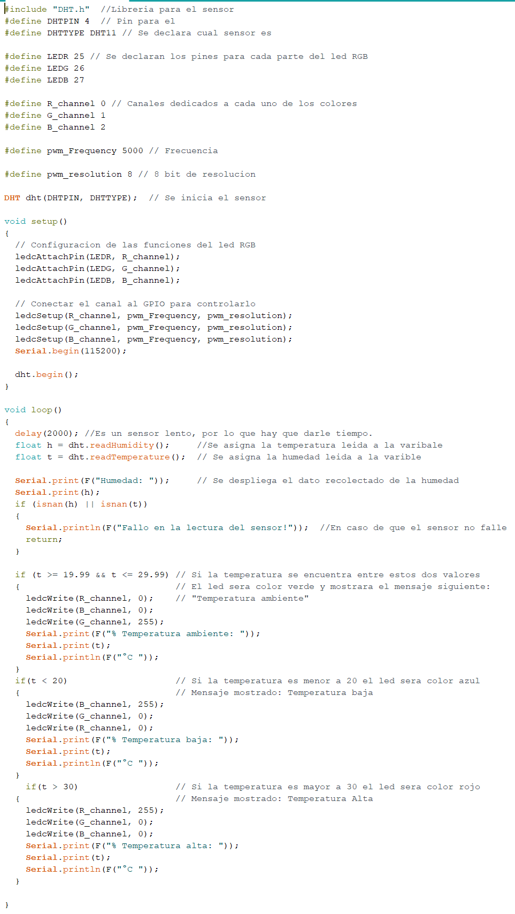
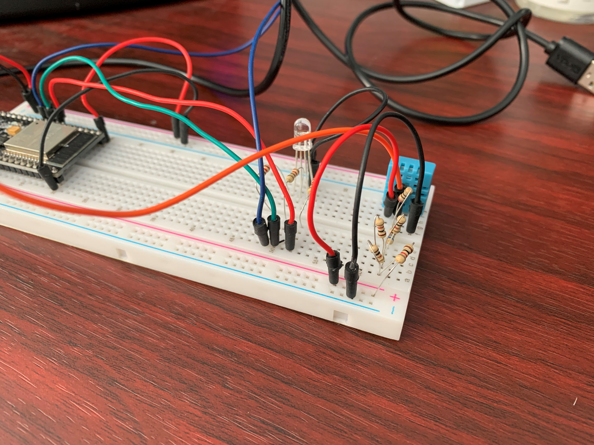
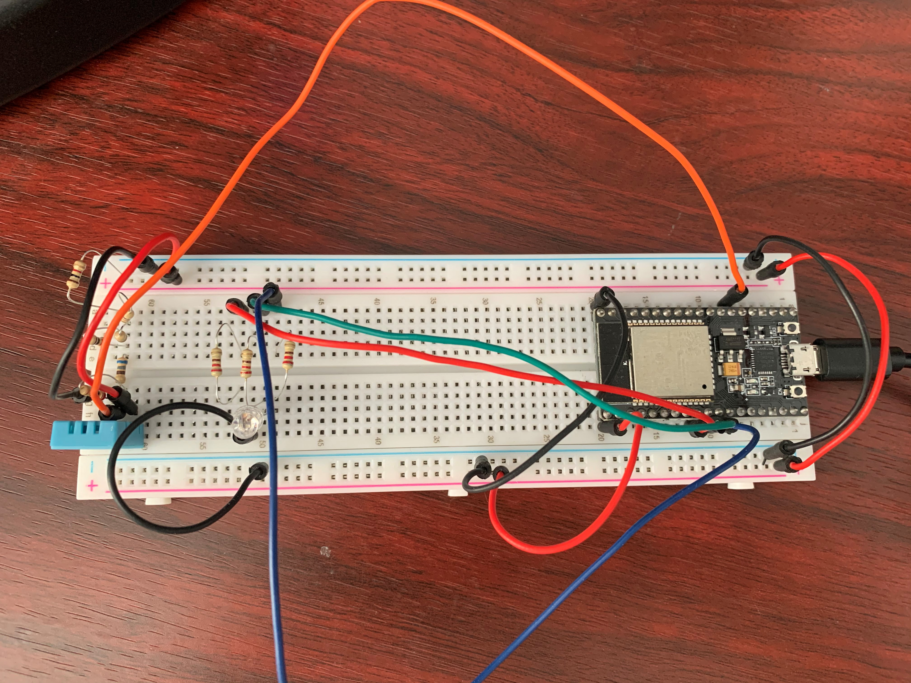

# :trophy: A.3.3 Actividad de aprendizaje

Circuito de medición de temperatura a través de un NodeMCU ESP32
___

## Instrucciones

- Basado en la figura 1, ensamblar un sistema, capaz de detectar la temperatura y humedad del ambiente, a través de un circuito electrónico, utilizando un NodeMCU **ESP32**, y un **Sensor DHT11/DHT22**.
- Toda actividad o reto se deberá realizar utilizando el estilo **MarkDown con extension .md** y el entorno de desarrollo VSCode, debiendo ser elaborado como un documento **single page**, es decir si el documento cuanta con imágenes, enlaces o cualquier documento externo debe ser accedido desde etiquetas y enlaces, y debe ser nombrado con la nomenclatura **A3.3_NombreApellido_Equipo.pdf.**
- Es requisito que el .md contenga una etiqueta del enlace al repositorio de su documento en GITHUB, por ejemplo **Enlace a mi GitHub** y al concluir el reto se deberá subir a github.
- Desde el archivo **.md** exporte un archivo **.pdf** que deberá subirse a classroom dentro de su apartado correspondiente, sirviendo como evidencia de su entrega, ya que siendo la plataforma **oficial** aquí se recibirá la calificación de su actividad.
- Considerando que el archivo .PDF, el cual fue obtenido desde archivo .MD, ambos deben ser idénticos.
- Su repositorio ademas de que debe contar con un archivo **readme**.md dentro de su directorio raíz, con la información como datos del estudiante, equipo de trabajo, materia, carrera, datos del asesor, e incluso logotipo o imágenes, debe tener un apartado de contenidos o indice, los cuales realmente son ligas o **enlaces a sus documentos .md**, _evite utilizar texto_ para indicar enlaces internos o externo.
- Se propone una estructura tal como esta indicada abajo, sin embargo puede utilizarse cualquier otra que le apoye para organizar su repositorio.
  
```
- readme.md
  - blog
    - C3.1_TituloActividad.md
    - C3.2_TituloActividad.md
    - C3.3_TituloActividad.md
    - C3.4_TituloActividad.md
    - C3.5_TituloActividad.md
    - C3.6_TituloActividad.md
    - C3.7_TituloActividad.md
    - C3.8_TituloActividad.md
  - img
  - docs
    - A3.1_TituloActividad.md
    - A3.2_TituloActividad.md
    - A3.3_TituloActividad.md
```

### Fuentes de apoyo para desarrollar la actividad:

   - [x] [Random Nerd Tutorial Touch pin](https://randomnerdtutorials.com/esp32-touch-pins-arduino-ide/)

   - [x] [Ejemplo de circuito con LED RGB Led](https://i0.wp.com/saber.patagoniatec.com/wp-content/uploads/2019/07/led-rgb-catodo-anado-comun.jpg)

___

## Desarrollo

1.Utilice el siguiente listado de materiales para la elaboración de la actividad

| Cantidad | Descripción                                                                                                                                                                                                                           |
| -------- | ------------------------------------------------------------------------------------------------------------------------------------------------------------------------------------------------------------------------------------- |
| 1        | [Sensor temperatura y humedad DHT11](https://articulo.mercadolibre.com.mx/MLM-664315278-sensor-de-temperatura-y-humedad-dht11-cjumpers-arduino-pic-_JM#position=1&type=item&tracking_id=b203e8cd-c375-429a-9b75-8c57e8b35386) o DHT22 |
| 1        | Diodo led [RGB](https://saber.patagoniatec.com/2019/07/como-funciona-un-led-rgb/)                                                                                                                                                                                                                         |
| 1        | Resistencia 4.7 [kohms](https://www.steren.com.mx/resistencia-de-carbon-de-1-2-watt-al-5-de-tolerancia-de-4-7-ohms.html)                                                                                                                                                                                                                 |
| 3        | Resistencias 1 [kohm](https://www.electrocomponentes.es/resistencias/resistencia-1k-ohm-025w-39-.html)                                                                                                                                                                                                                   |
| 1        | Fuente de voltaje de [5V](https://www.neoteo.com/tutorial-fuente-de-alimentacion-de-5v/)                                                                                                                                                                                                               |
| 1        | [NodeMCU ESP32](https://articulo.mercadolibre.com.mx/MLM-587686290-esp32-wifi-bluetooth-42-ble-nodemcu-esp8266-libro-gratis-_JM#position=1&type=item&tracking_id=84a6234b-5016-47eb-9950-39b49846ca72)                                |
| 1        | [BreadBoard](https://vicentferrer.com/protoboard-breadboard/)                                                                                                                                                                                                                            |
| 1        | Jumpers [M/M](https://www.330ohms.com/products/jumper-m-m-10cm-20-piezas)                                                                                                                                                                                                                           |
   


2. Basado en las imágenes que se muestran en la **Figuras 1**, ensamble el circuito en un solo circuito electrónico, ide tal manera que se pueda obtener un sistema capaz de cumplir con las instrucciones antes solicitadas para esta actividad.
  

<p align="center"> 
    <strong>Figura 1 Circuito ESP32 y Sensor DHT</strong>
    
</p>

1.  Una vez ensamblado el circuito anterior, agregue un LED RGB y elabore el programa que le permita al LED RGB funcionar como indicador para las siguientes condiciones:
    - El sensor de temperatura en todo momento estará sensando, enviando el valor registrado por la terminal serial, por ejemplo "Temperatura ambiente: 25 grados" y el **LED RGB** estará encendido de color verde.
    - El sensor de temperatura al registrar un valor del ~20% por arriba de la temperatura ambiental, deberá mostrar el mensaje "Temperatura alta: ? grados" y el **LED RGB** se encenderá de color rojo.
    - El sensor de temperatura al registra un valor del ~20% por abajo de la temperatura ambiental, deberá mostrar el mensaje "Temperatura baja: ? grados" y el **LED RGB** se encenderá de color azul.
2. Coloque aquí evidencias que considere importantes durante el desarrollo de la actividad.


### [Video demostrativo en Youtube](https://youtu.be/6XcvSi1ZHt8)






3. Conclusiones

Gonzalez Alexis
Para el desarrollo de esta practica fue util haber trabajado anteriormente con el LED RGB, por que ya sabia su funcionamiento. Y el sensor de humedad DTH11 no fue tan dificil como parecia, lo unico que se hizo fue descargar unas librerias que se ocupaban para su funcionamiento. Solamente hubo un pequeño problema, el cual fue el resistor ya que no contaba con uno que fuera de 4.7k y tuve que utilizar varios de 1K, uno de 680ohms y otro de 20ohms para dar con el deseado. Tampoco encontre problema con la programacion del codigo, se me hizo mas sensillo este que la actividad pasada.

Jiménez Julio 
En esta práctica se utilizó el sensor de humedad DHT11 y es de los menos complicados que hemos utilizados, aunque tuvimos que cambiar un poco la sensibilidad en cuanto a los límites de temperatura. En este caso utilizando el led RGB podemos identificar de manera visual si la temperatura es baja,mediana o alta, y a mi me pareció bastante útil pues puede tener diferentes usos en los casos de la vida cotidiana, ya sea incluso en nuestra computadora.
 
Diaz Jorge   
Con la realización de esta práctica se pudo ver el uso del esp32 con el sensor DHT11 el cual nos permite obtener lecturas de temperatura y humedad y usando un led RGB podemos manipularlo para alternar los colores del led de acuerdo a la lectura de la temperatura. Aplicando esta práctica con el led se pueden realizar otros proyectos que tengan el control y monitoreo de lo que es medido por el sensor para realizar un sistema de control de algún proceso.


### :bomb: Rubrica

| Criterios     | Descripción                                                                                  | Puntaje |
| ------------- | -------------------------------------------------------------------------------------------- | ------- |
| Instrucciones | Se cumple con cada uno de los puntos indicados dentro del apartado Instrucciones?            | 10      |
| Desarrollo    | Se respondió a cada uno de los puntos solicitados dentro del desarrollo de la actividad?     | 60      |
| Demostración  | El alumno se presenta durante la explicación de la funcionalidad de la actividad?            | 20      |
| Conclusiones  | Se incluye una opinión personal de la actividad  por cada uno de los integrantes del equipo? | 10      |

:house: [Ir a GitHub de Julio Jimenez](https://github.com/JJimenez2117/SistemasProg/blob/master/README.md)
 
:house: [Ir a GitHub de Jorge Diaz](https://github.com/JDavidDiaz/Sistemas-Programables)
 
:house: [Ir a GitHub de Alexis Gonzalez](https://github.com/GlzAlexis/Sistemas_Programables)